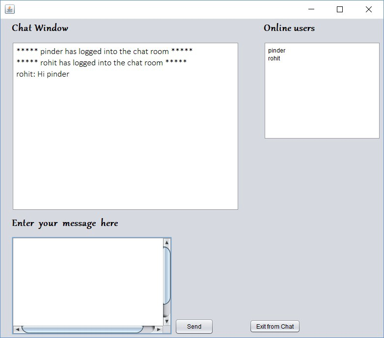

# LAN Chat Application

A real-time multi-user chat application for Local Area Networks (LAN) built with Java Swing and UDP multicast communication.

## Overview

This application allows multiple users on the same local network to communicate in real-time through a graphical chat interface. Users can see who's online, send messages to all participants, and receive instant notifications when users join or leave the chat room.

## Technologies Used

### Core Technologies
- **Java SE** - Primary programming language
- **Java Swing** - GUI framework for the desktop interface
- **Java AWT** - Additional GUI components and event handling
- **NetBeans IDE** - Development environment (evidenced by project structure)
- **Apache Ant** - Build automation tool

### Networking Protocol
- **UDP (User Datagram Protocol)** - Connectionless communication protocol
- **IP Multicast** - One-to-many network communication
- **DatagramSocket** - Java networking API for UDP communication
- **MulticastSocket** - Java API for multicast group communication

## Network Architecture

The application uses **UDP Multicast** protocol with the following configuration:

### Multicast Groups
- **Chat Messages**: `230.0.0.1:4446`
  - Used for broadcasting chat messages to all participants
- **Online Status**: `230.0.0.2:5000`
  - Used for tracking and broadcasting user presence/availability

### Communication Flow
1. **User Authentication**: Users enter their name to join the chat
2. **Group Joining**: Client joins both multicast groups simultaneously
3. **Message Broadcasting**: All messages are sent to the entire multicast group
4. **Presence Management**: Periodic status updates maintain online user list
5. **Graceful Exit**: Logout notifications are broadcast when users leave

## Features

- **Real-time Messaging**: Instant message delivery using UDP multicast
- **Online User Tracking**: Live display of currently connected users
- **Join/Leave Notifications**: Automatic announcements when users connect or disconnect
- **User-friendly GUI**: Clean Swing-based interface with multiple panels
- **Network Auto-discovery**: Automatic detection of other clients on the same network segment

## Project Structure

```
lan-chat-app/
├── src/chatapplication/
│   ├── ChatApp.java           # Main application entry point and login screen
│   ├── MultiClient.java       # User authentication and session management
│   ├── MulticastClient.java   # Main chat window and client logic
│   └── OnlineStatus.java      # User presence tracking and status management
├── nbproject/                 # NetBeans project configuration
├── build.xml                  # Ant build configuration
├── manifest.mf               # JAR manifest file
└── README.md                 # This file
```

## How It Works

### 1. Application Launch
- Users start the application and are presented with a login screen
- After entering a username, the main chat interface opens

### 2. Network Communication
- The application creates two multicast sockets for different purposes
- **Chat Socket** (`230.0.0.1:4446`): Handles all chat message traffic
- **Status Socket** (`230.0.0.2:5000`): Manages online user presence

### 3. Message Flow
- When a user sends a message, it's broadcast to all clients in the multicast group
- Each client receives the message and displays it in their chat window
- The sender's name is prepended to each message for identification

### 4. Presence Detection
- Each client periodically broadcasts its username to the status multicast group
- All clients maintain a list of recently active users
- Users who stop broadcasting are automatically removed from the online list

## System Requirements

- **Java Runtime Environment (JRE) 8+**
- **Network connectivity** within the same LAN segment
- **Multicast support** on the network infrastructure
- **Operating System**: Cross-platform (Windows, macOS, Linux)

## Network Prerequisites

- Clients must be on the same network segment (same subnet)
- Multicast traffic must be allowed by network configuration
- Firewall should allow UDP traffic on ports 4446 and 5000
- Router/switch must support IGMP (Internet Group Management Protocol)

## Building and Running

### Using NetBeans IDE
1. Open the project in NetBeans
2. Build the project (F11)
3. Run the main class `ChatApp`

### Using Ant (Command Line)
```bash
# Build the project
ant compile

# Create JAR file
ant jar

# Run the application
java -jar dist/MyProject.jar
```

### Manual Compilation
```bash
# Compile all Java files
javac -d build src/chatapplication/*.java

# Run the application
java -cp build chatapplication.ChatApp
```

## Usage Instructions

1. **Start the Application**: Launch the JAR file or run from IDE
2. **Enter Username**: Provide a unique name for identification
3. **Join Chat**: Click "Login to Chat Room" to enter the chat
4. **Send Messages**: Type in the message area and click "Send"
5. **View Online Users**: Check the right panel for currently active users
6. **Exit Gracefully**: Use "Exit from Chat" to properly disconnect

## App in Action



In the **Chat Window** box, type the message you want to send and click **Send**. The message will be broadcast to all users who are online in the same Local Area Network.

## Technical Implementation Details

### Multithreading
- **Main UI Thread**: Handles user interface interactions
- **Message Receiver Thread**: Continuously listens for incoming chat messages
- **Status Broadcaster Thread**: Periodically announces user presence
- **Status Receiver Thread**: Monitors online user status updates

### Error Handling
- Socket binding failure protection
- Network connectivity loss handling
- Graceful degradation when multicast is unavailable
- User input validation and sanitization

## Limitations

- **LAN Only**: Does not work across different network segments without routing configuration
- **No Encryption**: Messages are sent in plain text over the network
- **No Message History**: Chat history is not persisted between sessions
- **Basic Authentication**: No password protection or user verification
- **Network Dependent**: Requires multicast-enabled network infrastructure

## Future Enhancements

- **Message Encryption**: Add TLS/SSL for secure communication
- **Chat History**: Implement persistent message storage
- **Private Messaging**: Support for one-to-one conversations
- **File Sharing**: Allow users to share files through the chat
- **User Authentication**: Add password-based login system
- **Cross-Network Support**: Implement relay servers for WAN communication

## License

This project is open source and available under standard educational/demonstration license terms.

## Author

Originally developed by Pinder (as noted in source code comments).

